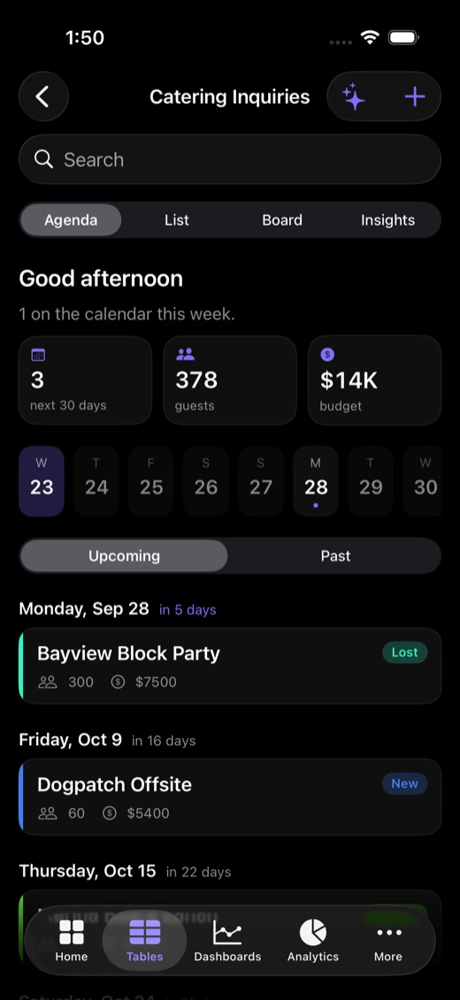
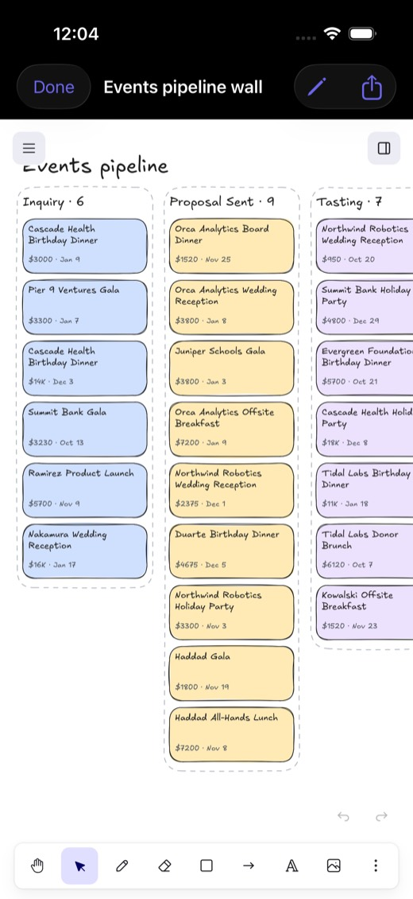

# OpenDesk

**The mobile app your open-source stack never shipped.**

OpenDesk is a native iPhone app for the tools teams already run: **NocoDB, Supabase, Airtable, Grafana, Metabase, GitLab and Excalidraw**. Connect your data, invite your team, and everyone gets the same app, with boards, agendas, dashboards, alerts, widgets, Siri and on-device AI.

It talks straight to each tool's existing API. There's no fork of the tool, no OpenDesk server, and no data migration.

[**Website**](https://opendesk-app.vercel.app) · [**Join the iPhone beta**](https://testflight.apple.com/join/HUq3TWc1) · [**Add your own tool**](AGENTS.md)

<p>




</p>
<p>



</p>

## Integrations

| Tool | Connect with | On the phone |
|---|---|---|
| **NocoDB** | URL + API token | Every base and table. Agenda, Grid, List, Board, Insights. Typed editor. Offline copy. |
| **Supabase** | Owner: one access token, then pick a project. Member: sign in as a user of your app. | Your tables with your row-level security. Enums become board lanes. Live notifications on changes. |
| **Airtable** | Personal access token | Every base the token can see, in the same views. Or copy a base into NocoDB with its own importer. |
| **Grafana** | URL (+ optional token) | Dashboards redrawn with Swift Charts from raw queries, time ranges and live mode, and an alerts inbox with AI triage. |
| **Metabase** | URL + API key | Dashboards and tabs, with every question redrawn natively: KPIs, lines, stacked bars, pie, funnel, scatter, tables. |
| **GitLab** | URL (+ optional token) | Merge requests, issues, pipelines, diffs, and a CI health strip. Summarize, comment, approve, retry. |
| **Excalidraw** | Nothing | "Map my database" and "Pipeline wall" boards generated from your data, fully editable, exported as `.excalidraw` files. |

Spreadsheets import too: pick a CSV from Files and column types are detected for you.

## Views that aren't just tables

Any table-shaped data (NocoDB, Supabase or Airtable) gets the same set of views:

- **Agenda:** calendar-first, based on the Radish Hub. It shows a greeting, 30-day totals, a date strip, and "party cards" grouped by day with a status stripe, guest count, value and venue. It works out which columns hold dates, people, money, places and status from their names.
- **Grid:** Airtable-style, with a frozen name column, typed headers, colored tags, and taps to open the full record.
- **Board:** drag-and-drop lanes on any select or enum column, with totals per lane.
- **Insights:** charts built automatically from money, select and date columns.
- **List** and a **typed record editor**: select chips, date pickers, ratings, tap-to-call and tap-to-email.

## Built for the phone

| | |
|---|---|
| **Voice edits** | Hold the mic and say *"Summit Bank tasting went great, book it, Dana captains."* You get a diff to review, and Apply writes it back. |
| **On-device AI** | Apple Intelligence answers questions about any table, dashboard or merge request, so your data never leaves the phone. Add a Claude key for bigger context. |
| **Notifications** | Supabase Realtime turns row changes into banners, like "Presidio Gala updated, Stage: Proposal → Booked". |
| **Siri** | "What's booked next in OpenDesk", "How's the pipeline in OpenDesk", "What's firing in OpenDesk". |
| **Widgets** | Pipeline value and the next booked events on the home and lock screen. |
| **Offline** | Every NocoDB read is cached, so it keeps working at a venue with no signal. |

## Teams

Teams run on Supabase Auth, Postgres and row-level security.

- **Admins** create a team, connect the tools, and publish the setup once.
- **Members** sign in (email link or password), join with a 6-letter code or QR, and get the same app on launch.
- Members can read the shared setup but can't change it. Outsiders see nothing, and the last admin can't be removed.

## Run it

```bash
# NocoDB (and optionally Metabase) to talk to
docker run -d --name nocodb -p 8080:8080 -v nocodb_data:/usr/app/data nocodb/nocodb:latest
docker run -d --name metabase -p 3000:3000 metabase/metabase:latest

# Fictional catering CRM for the demo
NOCO_TOKEN=... python3 scripts/seed_nocodb.py

# Optional: prefill connections for your builds (gitignored)
cp Config/LocalDefaults.example.plist Config/LocalDefaults.plist

# Build
xcodegen generate
open OpenDesk.xcodeproj   # set your team; run on an iPhone with Apple Intelligence for on-device AI
```

Grafana defaults to `play.grafana.org` and GitLab to public `gitlab.com` projects, so both work with no setup.

To browse a Supabase app as its users (rather than as the owner), the project owner runs the read-only `opendesk_schema()` helper once. The SQL is in the app under Supabase → "I use the app".

## Add your own tool

Every integration follows the same pattern: a small REST client plus a few SwiftUI screens. Fork the repo and tell your coding agent:

> Add an OpenDesk connector for **Twenty CRM** at https://crm.mycompany.com. Follow AGENTS.md.

For table-shaped data, implement one `TableSource`, and Agenda, Grid, Board, Insights, the editor and voice edits all work with it. See [AGENTS.md](AGENTS.md).

## Layout

```
OpenDesk/
  App/         entry point, tabs, deep links, Siri shortcuts
  Core/        JSON, HTTP, config, theme, brand marks
  NocoDB/      TableSource, Agenda / Grid / Board / Insights, record editor, voice command bar
  Supabase/    owner + member connect, RLS-respecting source, Realtime notifications
  Airtable/    direct connector and TableSource
  Grafana/     dashboards (ds/query → Swift Charts), alerts inbox
  Metabase/    dashboards, tabs, native card renderers
  GitLab/      projects, MRs, issues, pipelines, diffs
  Whiteboard/  Excalidraw boards generated from data
  Teams/       Supabase auth, teams, roles, shared connections
  Onboarding/  connect, Airtable / CSV import, invite
  AI/          on-device ⇄ Claude, ask sheet, edit planning, voice input
OpenDeskWidget/  WidgetKit pipeline widget
site/            landing page (Vercel)
```

## License

MIT. Built at an AI enterprise hackathon in Palo Alto, September 2026, with Claude Code.
