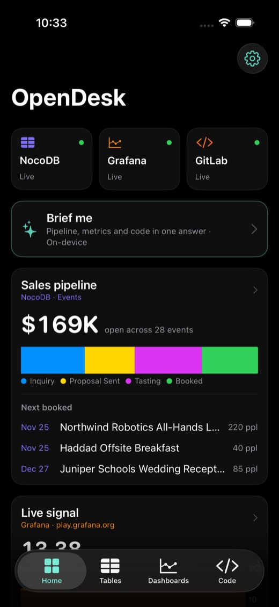
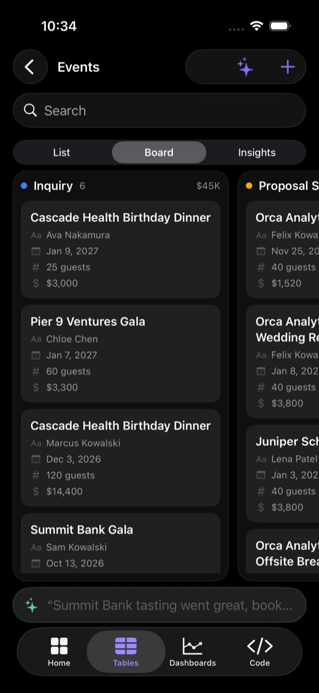
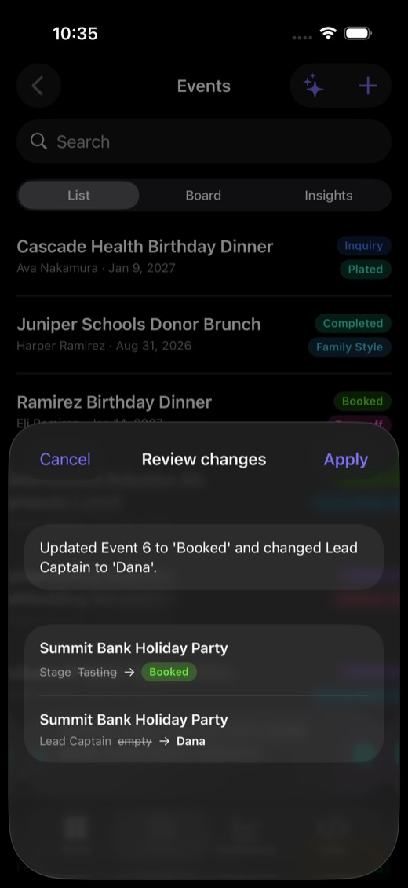
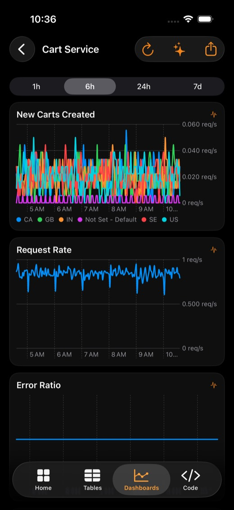
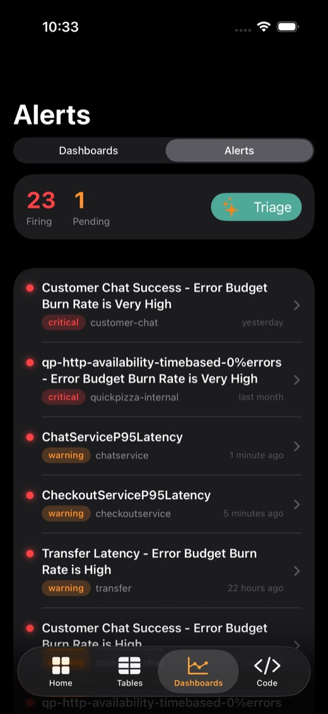
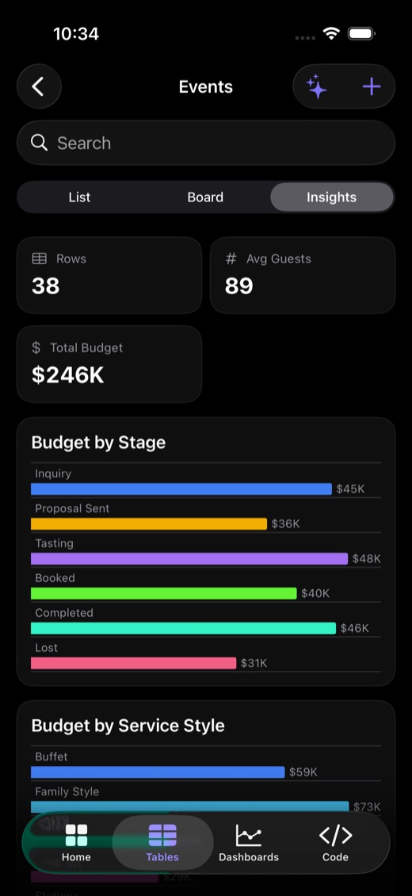
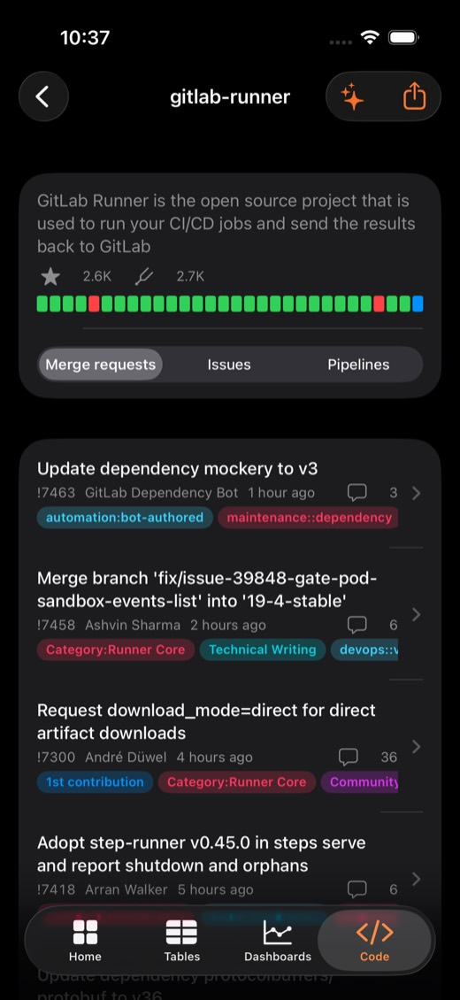
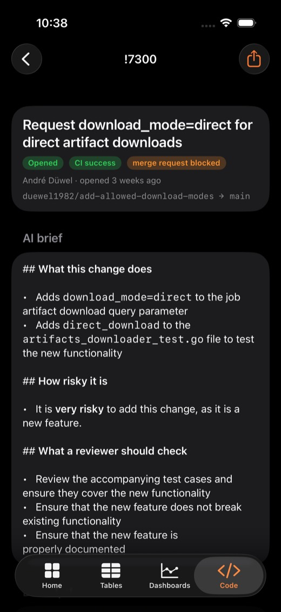
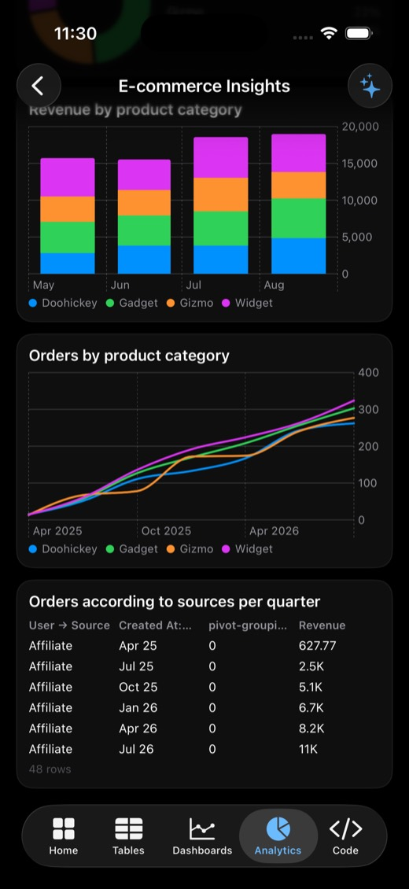

# OpenDesk

A native iOS app for the self-hosted, open-source tools companies already run: **NocoDB** (no-code database / CRM), **Grafana** (dashboards), **Metabase** (BI) and **GitLab** (code, merge requests, CI). None of them ships an official mobile app for this. OpenDesk is one SwiftUI app that talks to each tool's existing REST API. There is no backend of its own and nothing to migrate.

Built at an AI enterprise hackathon in Palo Alto, September 2026. **Site:** https://opendesk-app.vercel.app · **Add your own tool:** see [AGENTS.md](AGENTS.md).

<p>




</p>
<p>




</p>
<p></p>

## What it does

| Module | Talks to | On the phone |
|---|---|---|
| **Tables** | NocoDB `/api/v2` | Browse bases and tables · list, **drag-and-drop Kanban** on any single-select field, **Insights** charts · typed record editor (select chips, dates, ratings, call/email) · create and delete rows |
| **Dashboards** | Grafana `/api/search`, `/api/dashboards`, `/api/ds/query`, `/render` | Dashboards redrawn as **native Swift Charts** from raw datasource queries, with a server-rendered PNG fallback · 1h/6h/24h/7d ranges · 15s live refresh · scrub for values |
| **Analytics** | Metabase `/api/search`, `/api/dashboard`, dashcard query | Dashboards with tabs, every question re-rendered natively: scalars with trend, line/area/bar/row with breakouts, pie, funnel, scatter, tables · AI takeaways |
| **Code** | GitLab `/api/v4` | Pinned OSS projects · MRs, issues, pipelines · CI health strip · diffs by file · job stages · comment, approve and retry with a token |
| **Home** | all three | Cross-tool snapshot: pipeline value, a live Grafana signal and CI health · "Brief me" |
| **Widget** | NocoDB | Home and lock screen widget with pipeline value and the next booked events |
| **Offline** | NocoDB | Every read is cached to disk; if the server drops, the app keeps working from the last synced copy |
| **Siri** | NocoDB, Grafana | "What's booked next in OpenDesk", "How's the pipeline in OpenDesk", "What's firing in OpenDesk" |

### AI, private by default

- **Ask** (the ✦ button on any table, dashboard or project): questions answered against that screen's live data.
- **Tell it what changed** (the bar at the bottom of a table): *"Summit Bank tasting went great, book it, Dana captains"* becomes a reviewed diff (`Stage: Tasting → Booked`, `Lead Captain: → Dana`), and you tap Apply to write it back to NocoDB.
- **Summarize this MR / issue**: a three-bullet risk brief from the description, diff and discussion.

The default engine is **Apple Intelligence running on the phone** (`FoundationModels`), with guided generation (`@Generable`) for structured edits, so business data never leaves the device. If you add an Anthropic key in Settings, it switches to Claude for larger context.

The on-device model has a 4K-token window. To make it reliable at picking the right row, the app first narrows the table to the few rows the instruction plausibly names, using lexical scoring. It also passes the model each select column's allowed options and the existing values of short-vocabulary text columns.

## Run it

```bash
# 1. A NocoDB to talk to
docker run -d --name nocodb -p 8080:8080 -v nocodb_data:/usr/app/data nocodb/nocodb:latest
# create an account at http://localhost:8080, then an API token (Team & Settings → API Tokens)

# 2. Seed the demo catering CRM (fictional data)
NOCO_TOKEN=... python3 scripts/seed_nocodb.py

# 2b. Optional: Metabase with its sample E-commerce dashboard
docker run -d --name metabase -p 3000:3000 metabase/metabase:latest
# finish setup at http://localhost:3000, then Admin → Authentication → API keys

# 3. Point the app at it (optional, you can also set this in the app's Settings)
cp Config/LocalDefaults.example.plist Config/LocalDefaults.plist   # set nocoURL to your Mac's LAN IP

# 4. Build
xcodegen generate
open OpenDesk.xcodeproj    # set your team, run on a device with Apple Intelligence
```

Grafana defaults to the public `play.grafana.org`, and GitLab to public projects on `gitlab.com`. Both work with no token.

## Layout

```
OpenDesk/
  App/        entry point, tab root, deep links (opendesk://tables)
  Core/       JSONValue, HTTP, AppConfig (UserDefaults + LocalDefaults.plist), theme
  NocoDB/     client, table/board/insights views, record editor, AI command bar
  Grafana/    client (search, dashboard JSON, ds/query → Series), dashboard + panel views
  GitLab/     client, project/MR/issue/pipeline/diff views
  Metabase/   client (dashboards, tabs, dashcard queries), native card renderers
  AI/         engine switch (on-device ⇄ Claude), AskSheet chat, edit planning
  Home/       cross-tool home, settings
OpenDeskWidget/   WidgetKit pipeline widget
scripts/      seed_nocodb.py, make_icon.swift
```

## Roadmap ideas

- Grafana alerting inbox with push (Alertmanager webhook → APNs), acknowledge/silence from the lock screen
- More connectors on the same pattern: Twenty, Plane, Zammad, Uptime Kuma
- Upstream: contribute the NocoDB and Grafana clients as standalone Swift packages
